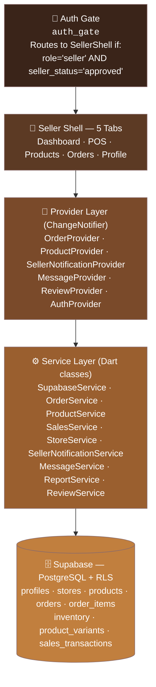
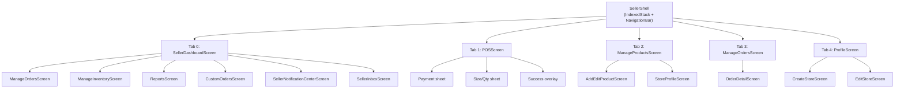
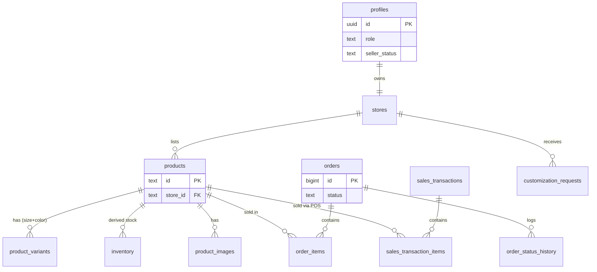
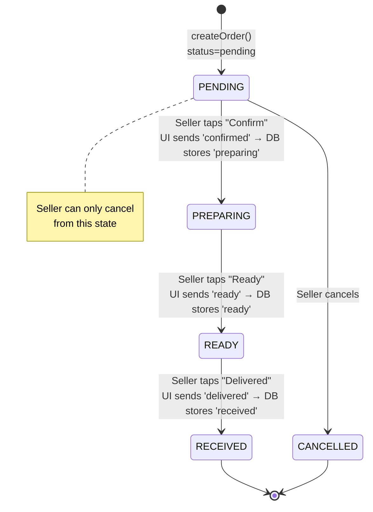
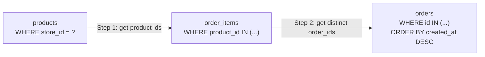
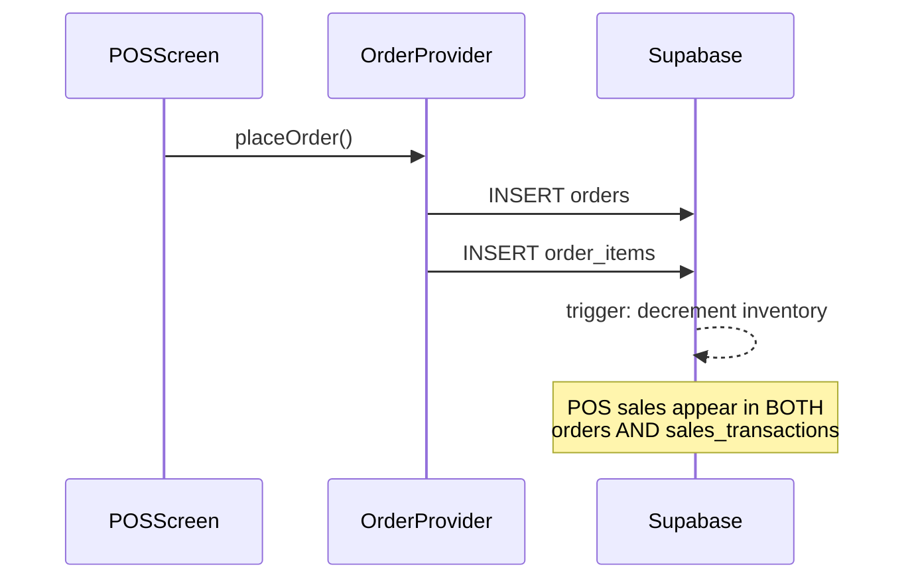
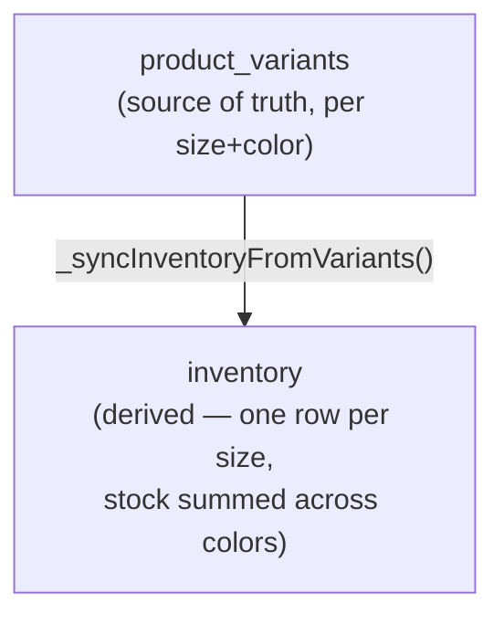

# Seller Architecture — Quick Reference Graph

> **Purpose:** High-level architecture reference for AI agents. Just enough context to navigate and modify seller-side code safely.
> **Audience:** AI agents unfamiliar with the seller module.
> **Last updated:** July 29, 2026

## Table of Contents
1. [30-Second Orientation](#1-30-second-orientation)
2. [Architecture Layers](#2-architecture-layers)
3. [Seller Shell Navigation](#3-seller-shell-navigation)
4. [Database Schema (ER Diagram)](#4-database-schema-er-diagram)
5. [⚠️ Critical: Dual Status Vocabulary](#5-️-critical-dual-status-vocabulary)
6. [Order Status State Machine](#6-order-status-state-machine)
7. [Key Data Flow Patterns](#7-key-data-flow-patterns)
8. [File Map (Quick Lookup)](#8-file-map-quick-lookup)
9. [Common Task Recipes](#9-common-task-recipes)
10. [Gotchas & Landmines](#10-gotchas--landmines)
11. [Pre-Flight Checklist](#11-pre-flight-checklist-before-you-edit-anything)

---

## 1. 30-Second Orientation

If you only read one section, read this:

- **Stack:** Flutter (Dart) frontend → Provider (ChangeNotifier) state → Service classes → Supabase (Postgres + RLS).
- **The #1 bug source** is the gap between UI status labels and DB status values — see [Section 5](#5-️-critical-dual-status-vocabulary) before touching anything order-related.
- **Orders don't have a `store_id`.** You must join through `products` and `order_items` — see [Pattern A](#pattern-a-store-orders-3-step-chain).
- **Inventory is never edited directly** — it's derived from `product_variants`. See [Pattern D](#pattern-d-inventory-is-derived).
- **Revenue = online orders + POS sales, always combined.** Never report one without the other.

---

## 2. Architecture Layers



**Rule of thumb for where to make a change:**

| You want to... | Touch this layer |
|---|---|
| Change what's on screen / a widget's look | Screens / Widgets |
| Change what triggers a rebuild / cache state in memory | Providers |
| Change a query, a calculation, or how data is fetched | Services |
| Change what's persisted or how RLS restricts access | Supabase (migration) |

---

## 3. Seller Shell Navigation



> ⚠️ Note: `ManageOrdersScreen` is reachable from **both** Tab 0 (Dashboard → "Manage Orders" shortcut) and Tab 3 (the dedicated Orders tab). Confirm which entry point you're editing — they may pass different filter defaults.

---

## 4. Database Schema (ER Diagram)



**Reading this diagram:** `orders` has no direct FK to `stores`. That's intentional (see Pattern A below) but it's the reason a naive `SELECT * FROM orders WHERE store_id = ?` will fail — that column doesn't exist.

| Table | ID Type | Notes |
|---|---|---|
| `products` | `TEXT` | Not a native UUID — don't assume UUID validation/formatting |
| `orders` | `BIGINT` | Auto-incrementing |
| `inventory` | — | **Derived only.** Never write to this table directly |
| `sales_transactions` | — | POS-only; created alongside `orders` for in-person sales |

---

## 5. ⚠️ CRITICAL: Dual Status Vocabulary

The system has **two sets of status values** — this is the #1 source of bugs.

| UI Label (seller sees) | DB Value (stored) | Customer sees in |
|---|---|---|
| "Pending" | `pending` | "Processing" tab |
| "Confirmed" | `preparing` | Timeline step 2 |
| "Ready" | `ready` | Timeline step 3 |
| "Delivered" | `received` | Timeline step 4 |
| "Cancelled" | `cancelled` | "Returns" tab |

**The mapping layer** exists **only** in `SupabaseService.updateOrderStatus()`:

```dart
final statusMap = <String, String>{
  'confirmed': 'preparing',   // UI → DB
  'delivered': 'received',    // UI → DB
};
final dbStatus = statusMap[newStatus.toLowerCase()] ?? newStatus.toLowerCase();
```

**When writing code:** always ask "am I holding a UI label or a DB value right now?" If a screen sends `'confirmed'` straight to `updateOrderStatus()`, the DB stores `'preparing'` — searching the DB for `status = 'confirmed'` will always return zero rows.

🚩 **Known violation:** `seller_orders_screen.dart` bypasses this mapping layer and sends raw DB values directly (see [Gotcha #5](#10-gotchas--landmines)). Check that file specifically before assuming the mapping is applied everywhere.

---

## 6. Order Status State Machine



**Transitions not shown above are not supported by the current UI.** If you need to add a "revert to pending" or similar backward transition, that's new functionality — check `order_status_history` writes accordingly so the audit trail stays honest.

---

## 7. Key Data Flow Patterns

### Pattern A: Store Orders (3-Step Chain)

Orders don't link directly to a store for querying. Instead:



```sql
-- Step 1
SELECT id FROM products WHERE store_id = ?;
-- Step 2
SELECT DISTINCT order_id FROM order_items WHERE product_id IN (...);
-- Step 3
SELECT * FROM orders WHERE id IN (...) ORDER BY created_at DESC;
```

**Why this matters:** this is a 3-hop join disguised as a single query in most callers. If you're debugging "why don't I see this order," check each hop — a product removed from a store, or an order_item pointing to a deleted product, silently breaks the chain.

### Pattern B: POS Creates Order + Sales Transaction



### Pattern C: Revenue Is Always Combined

```dart
revenue = onlineOrders Revenue + POS revenue
// Both from 'orders' table and 'sales_transactions' table
```

Any dashboard, report, or export that shows "revenue" and only queries one of these two tables is producing an **incomplete number**, not just a differently-scoped one. Treat this as a correctness bug, not a design choice, if you find it.

### Pattern D: Inventory Is Derived



**Rule:** always call `_syncInventoryFromVariants()` after any variant change (add/edit/delete/stock adjustment). If you write to `inventory` directly, it will drift from `product_variants` and silently produce wrong stock counts on the storefront.

---

## 8. File Map (Quick Lookup)

| Layer | File | Purpose |
|---|---|---|
| **Shell** | `lib/screens/seller/seller_shell.dart` | 5-tab navigation + push deep-links |
| **Screens** | `lib/screens/seller/seller_dashboard_screen.dart` | Metrics, alerts, recent orders, charts |
| | `lib/screens/seller/pos_screen.dart` | In-person POS, 2-panel layout |
| | `lib/screens/seller/manage_products_screen.dart` | Product grid (masonry), CRUD actions |
| | `lib/screens/seller/manage_orders_screen.dart` | Tab-filtered order list, status transitions |
| | `lib/screens/seller/order_detail_screen.dart` | Single order view + timeline |
| | `lib/screens/seller/manage_inventory_screen.dart` | Stock sliders, auto-sync |
| | `lib/screens/seller/reports_screen.dart` | Sales reports, charts, top products |
| | `lib/screens/seller/custom_orders_screen.dart` | Customization request management |
| | `lib/screens/seller/seller_notification_center_screen.dart` | Notification feed |
| | `lib/screens/seller/seller_inbox_screen.dart` | Message inbox |
| **Providers** | `lib/providers/order_provider.dart` | Order state + CRUD |
| | `lib/providers/product_provider.dart` | Product state + CRUD |
| | `lib/providers/seller_notification_provider.dart` | Notification state + Realtime |
| | `lib/providers/message_provider.dart` | Conversation state + Realtime |
| **Services** | `lib/services/supabase_service.dart` | Core DB operations + status mapping ⚠️ |
| | `lib/services/order_service.dart` | Order queries (3-step chain) |
| | `lib/services/product_service.dart` | Product CRUD + inventory sync |
| | `lib/services/sales_service.dart` | Revenue calculations (online + POS) |
| | `lib/services/store_service.dart` | Store CRUD (1 store per seller) |
| | `lib/services/seller_notification_service.dart` | Notification creation + push |
| | `lib/services/message_service.dart` | Message CRUD + Realtime |
| **DB Migrations** | `supabase/migrations/20260720*.sql` | Order status history |
| | `supabase/migrations/20260721*.sql` | Order cancellation fields |
| | `supabase/migrations/20260722*.sql` | Status CHECK constraint fix |
| **Widgets** | `lib/widgets/seller/seller_order_card.dart` | Order card + action button |
| | `lib/widgets/seller/seller_status_chip.dart` | Colored status badge (UI labels) |
| | `lib/widgets/seller/seller_metric_card.dart` | Dashboard metric cards |
| | `lib/widgets/seller/seller_inventory_row.dart` | Stock slider row |

---

## 9. Common Task Recipes

Quick "where do I even start" guidance for frequent request types.

| Task | Start here |
|---|---|
| Add a new order status filter tab | `manage_orders_screen.dart` (UI) → check `order_service.dart` query → confirm mapping in `supabase_service.dart` |
| Change how revenue is calculated | `sales_service.dart` — **must** touch both `orders` and `sales_transactions` queries (Pattern C) |
| Add a new product field | `product_service.dart` (CRUD) → `add_edit_product_screen.dart` (form) → migration for the `products` table |
| Fix stock count mismatch | Check `_syncInventoryFromVariants()` is called on every variant mutation path — do **not** patch `inventory` directly |
| Add a dashboard chart/metric | `seller_dashboard_screen.dart` (widget) → `reports_screen.dart` / `sales_service.dart` (data source) → `seller_metric_card.dart` (presentation) |
| Debug "order not showing for this store" | Walk Pattern A's 3-step chain manually — check each hop for orphaned/deleted rows |
| Add a new order status transition | Update state machine (Section 6), `order_status_history` writes, `statusMap` in `supabase_service.dart`, and RLS policy if customer-visibility changes |

---

## 10. Gotchas & Landmines

1. **Product IDs are `TEXT`**, not native UUID. Order IDs are `BIGINT`. Don't assume UUID formatting/validation on product IDs.
2. **Inventory is derived** from `product_variants` — never edit `inventory` directly.
3. **POS creates BOTH** an `orders` row and a `sales_transactions` row — a fix that touches order creation logic likely needs a mirrored fix on the POS path too.
4. **Revenue always combines** online + POS — never report from just one source.
5. **Some screens bypass the mapping layer.** `seller_orders_screen.dart` sends raw DB values instead of UI labels — don't assume `SupabaseService.updateOrderStatus()`'s mapping is universally applied.
6. **RLS on orders:** customers see only their own orders; sellers see only orders containing products from their store (enforced via the same 3-step relationship as Pattern A, not a direct FK).

---

## 11. Pre-Flight Checklist (Before You Edit Anything)

- [ ] Am I passing a **UI label** or a **DB value** at this call site? (Section 5)
- [ ] If touching orders: does this query need the **3-step store join**, or does it already have `order_id`/`product_id` in hand? (Pattern A)
- [ ] If touching inventory: am I mutating `product_variants` and calling `_syncInventoryFromVariants()`, not writing to `inventory` directly? (Pattern D)
- [ ] If touching revenue/reports: am I reading from **both** `orders` and `sales_transactions`? (Pattern C)
- [ ] If adding a new order status: have I updated the state machine, the status map, `order_status_history`, and RLS policies together?
- [ ] Have I checked `seller_orders_screen.dart` specifically, since it's a known exception to the standard mapping flow?

---

*SoleVision Seller Architecture Quick Reference — July 29, 2026*
